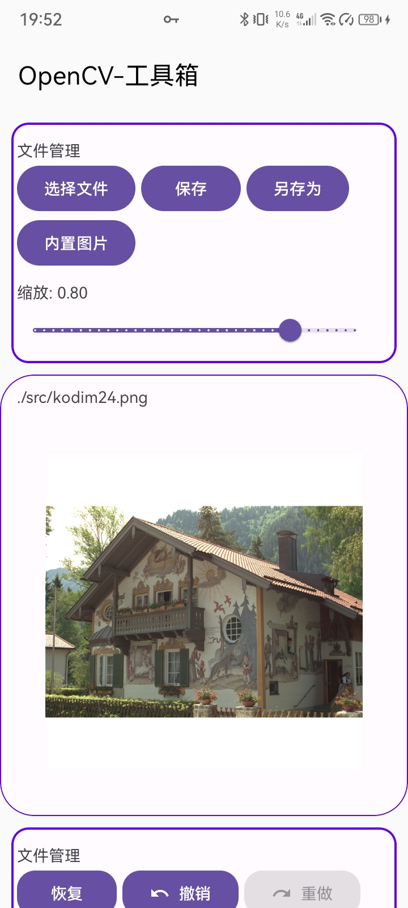

<p align="center">
  
</p>

<h1 align="center">OpenCV-工具箱</h1>

<p align="center">
  <strong>🎨 一个基于AutoJs Pro 9.3.11, 使用犀牛（Rhino）引擎, Js + xml实现 的 OpenCV-工具箱</strong>
</p>

<p align="center">
  <strong>并使用 Google Material Design3 的 Android 原生ui界面</strong>
</p>

<p align="center">
  
  
  
  
</p>

---

## 📱 预览截图

<p align="center">
  
</p>

---

## ✨ 功能特性
色彩空间转换
- RGB 色彩空间
- GRAY 色彩空间
- YCrCB 色彩空间
- HSV 色彩空间

几何变换
- 缩放
- 1. 最近邻插值
- 2. 双线性插值
- 3. 3次样条插值
- 4. 区域插值
- 5. Lanczos 差值
- 6. 位精确差值
- 翻转
- 1. 垂直翻转
- 2. 水平翻转
- 3. 水平、垂直反转

图像模糊
- 均值滤波
- 高斯模糊
- 方框滤波
- 中值滤波

阈值处理
- 二值化阈值处理
- 反二值化阈值处理
- 截断阈值处理
- 低阈值处理
- 超阈值处理
- Qtsu 阈值处理
- 三角算法阈值处理
- 自适应阈值处理

形态变换
- 腐蚀
- 膨胀

边缘检测
- Laplacian 边缘检测
- Sobel 边缘检测
- Canny 边缘检测

轮廓绘制
- 所有轮廓
- 外部轮廓
- 绘制所有线条

---

## 🚀 环境要求

| 环境             | 版本要求 |
|----------------|---------|
| **AutoJs Pro** | 9.0+ (推荐 9.3.11) |
| **Android**    | 7.0+ (API 24+) |
| **autoJs 引擎**  | Rhino犀牛引擎 |

---

---

## 📁 项目结构

```
AutoJs-OpenCV-toobox/
├── main.js          # 主入口文件
├── project.json              # 项目配置文件
├── images/                   # 图片资源
│   ├── ic_app_logo.png       # 应用图标
├── js/
|   ├── imgProc.js            # OpenCV 图像处理具体内容
├── libs/*                    # lib库
├── res/
    └── layout/               # XML 布局文件
        ├── activity_main.xml       # 主界面布局
├── src/*                     # 内置图片
├── temp/*                    # 项目启动时缓存文件，如当前图片
├── ui/
|   ├── uiInit.js                  # ui初始化
|   ├── uiOn.js                    # 处理事件
|   ├── uiTSMItem.js               # OpenCV 图像处理选择菜单文件树
|   ├── uiTypeSelectMenu.js        # 图像处理选择菜单事件
```

---

---

## 📚 相关资源

- [Auto.js Pro 官方文档](https://www.wuyunai.com/docs/)
- [Material Design 3 官方指南](https://m3.material.io/)
- [Material Components for Android](https://github.com/material-components/material-components-android)

---

## 🙏 致谢

- [hyb1996/Auto.js](https://github.com/hyb1996/Auto.js)

**许可说明**：
- ✅ 允许商业使用
- ✅ 允许修改分发
- ✅ 允许私人使用
- ⚠️ 需保留版权声明

---
## 👨‍💻 作者

- **Email**: Azek431@163.com
- **QQ**: 2982154038

---

<p align="center">
  如果这个项目对你有帮助，请给一个 ⭐ Star 支持一下！
</p>

也可以给我们赞赏a
<p align="center">
  
  
</p>


